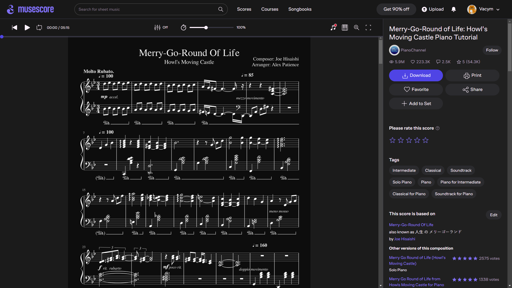

# Musescore Dark

Musescore Dark is a customizable dark theme for musescore.com, designed to enhance your browsing experience on the Musescore platform.

### Preview

### Installation

To use Musescore Dark, install the Stylus browser extension. If you don't have it, follow the [Stylus Wiki](https://github.com/openstyles/stylus/wiki/Usercss#how-do-i-install-usercss) for installation instructions.

### Limitations

- **Not Supported on Pro Pages:** Please note that the dark theme is not supported on pages requiring a pro subscription, including Music Courses.

### Contribution

Contributions are welcome! If you have any ideas or improvements, feel free to [create a pull request](https://github.com/Vacym/Musescore-Dark/pulls) on the GitHub repository.
